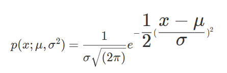
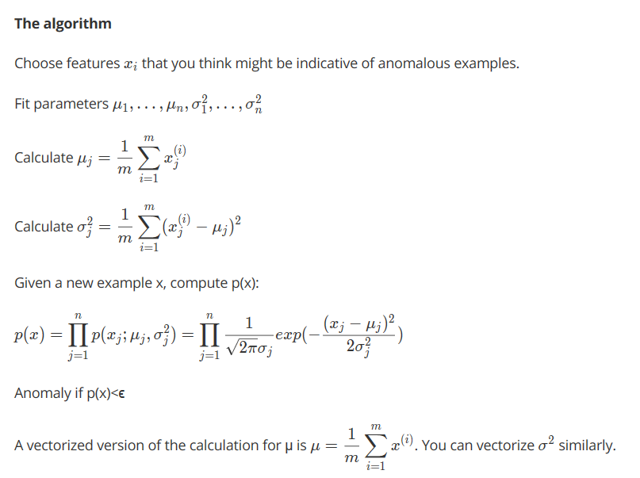

# Outlier Detection
  
**Introduction**
  
Like the case of other learning algorithms , we are given a set of data points x<sup>(1)</sup>,x<sup>(2)</sup>,...x<sup>(m)</sup> , which could be used for fitting the parameters for the algorithm.  
When we are given a new data point x<sup>(test)</sup> , we should then be able to predict if this example is abnormal or anomalous.  
We define a "model" p(x) that tells us the probability the example is not anomalous. We also use a threshold ϵ (epsilon) as a dividing line so we can say which examples are anomalous and which are not.  
  
**Probability Function**
    
The Gaussian Distribution is used , which is a familiar bell-shaped curve that can be described by a function N(μ,σ<sup>2</sup>).  
The Gaussian Distribution is parameterized by a mean and a variance.  
Mu, or μ, describes the center of the curve, called the mean. The width of the curve is described by sigma, or σ, called the standard deviation.  
The full function is as follows:  

  
**Algorithm**
  


**Implementation (in a nutshell) : ** 
```
1) Divide the given training data set into three parts : 
  a) training set (consisting of about 60% of dataset , usually all of them being the normal or non-anomalous
     examples).
  b) cross-validation set (20% of dataset with around half the number of anomalous examples and some normal
     examples).
  c) test set (20% of dataset with around half the number of anomalous examples and some normal examples).
  
2) Fit the parameters, using the training set.

3) Compute the probability density for the examples in cross-validation set using the parameters set in (2).

4) Determine appropriate threshold using the cross-validation probability density and the original labels for
   the examples.Also , determine the F1 score as an evaluation metric .
   
5) Compute the probability density for the examples in test set using the parameters set in (2).

6) Label the examples using the probability density obtained in (5) and the threshold computed in (4).

7) If test set error is low, algorithm works fine . Otherwise , try to develop more distinguishing features and
   try to choose appropriate threshold.
```

